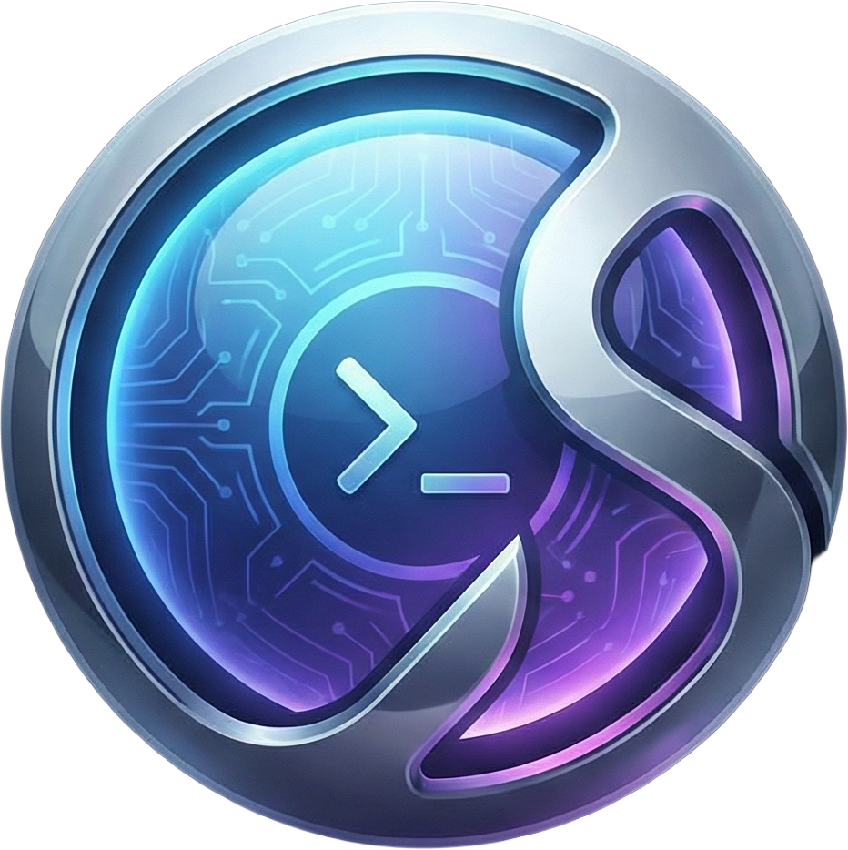

<div align="center">
  
  <h1>🚀 OmniShell</h1>
  <p><strong>Beta Release v1.0.0</strong></p>
  <p>A modern Windows productivity tool for folder management and customizable widgets</p>
</div>

## ✨ Features

### 📁 Folder Management

- **Color Tinting** - Customize folder icons with 9 vibrant colors (Red, Orange, Yellow, Green, Blue, Purple, Pink, Cyan, Gray)
- **Instant Application** - Changes apply immediately to Windows Explorer
- **Easy Reset** - Restore folders to default icons with one click

### ⚙️ Customizable Sidebar

- **8 Built-in Widgets**:
  - 📋 Clipboard Manager - Quick access to clipboard history
  - 💻 System Monitor - CPU, RAM, and disk usage
  - 📅 Calendar - Current date and events
  - 🌤️ Weather - Location-based weather updates
  - ⏱️ Pomodoro Timer - Focus timer with session tracking
  - 📝 Quick Notes - Persistent note-taking
  - 🔋 Battery Monitor - Power status and estimates
  - 📡 Network Info - Connection and speed monitoring

- **Widget Management**:
  - Show/hide individual widgets
  - Drag to reorder
  - Persistent configuration

### 🎯 System Integration

- **System Tray** - Minimize to tray for background operation
- **Windows Startup** - Optional auto-start with Windows
- **Data Persistence** - All settings and widget states saved automatically
- **Modern UI** - Clean, dark-mode interface with smooth animations

## 📥 Download & Installation

### Quick Start (Recommended)

1. **Download** the latest release:
   - Go to [Releases](https://github.com/Almoksha/OmniShell/releases)
   - Download `OmniShell-v1.0.0-win-x64.zip`

2. **Extract** the ZIP file to a folder of your choice

3. **Run** `OmniShell.exe`
   - No installation required!
   - No .NET runtime needed (self-contained)

### Building from Source

1. **Clone the repository**

   ```bash
   git clone https://github.com/Almoksha/OmniShell.git
   cd Omni-Shell
   ```

2. **Restore dependencies**

   ```bash
   dotnet restore
   ```

3. **Build the project**

   ```bash
   dotnet build
   ```

4. **Run the application**
   ```bash
   dotnet run
   ```

## 📖 Usage

### Changing Folder Colors

1. Launch OmniShell
2. Click on **Folder Tinting** in the navigation menu
3. Click **Browse** to select a folder
4. Click on any color to apply it instantly
5. Click the **×** button to reset to default

### Managing Sidebar Widgets

1. Click on **Sidebar Configuration** in the navigation menu
2. Click **Show Sidebar** to open the widget panel
3. Toggle individual widgets on/off
4. Drag widgets to reorder them
5. Click **Save Configuration** to persist changes
6. Choose between **Floating** or **Docked** sidebar modes

### System Tray Features

- **Minimize to Tray** - Close button minimizes to system tray
- **Quick Access** - Right-click tray icon for quick actions
- **Background Operation** - Run OmniShell in the background

## 🛠️ Technologies

- **Framework**: .NET 8.0 / WPF
- **Language**: C#
- **UI**: XAML with modern design patterns
- **Icons**: Custom-generated colored folder icons
- **Persistence**: JSON-based settings storage

## 🏗️ Project Structure

```
OmniShell/
├── Core/              # Plugin system and interfaces
├── Services/          # Icon generation, settings management
├── Tools/             # FolderTint and Sidebar plugins
├── Views/             # UI pages and widgets
│   ├── Widgets/      # Sidebar widget components
│   └── SettingsPage.xaml
├── Resources/         # App icon and assets
└── MainWindow.xaml    # Main application window
```

## 🔮 Roadmap

### Completed ✅

- [x] Folder color tinting with 9 colors
- [x] Customizable sidebar with 8 widgets
- [x] System tray integration
- [x] Windows startup support
- [x] Complete data persistence
- [x] Self-contained installer

### Planned Features

- [ ] Additional folder customization options
- [ ] More widget types (Crypto, Stocks, etc.)
- [ ] Custom color picker
- [ ] Keyboard shortcuts
- [ ] Multi-language support
- [ ] MSI installer package

## 🤝 Contributing

Contributions are welcome! Please feel free to submit pull requests or open issues for bugs and feature requests.

1. Fork the repository
2. Create a feature branch (`git checkout -b feature/AmazingFeature`)
3. Commit your changes (`git commit -m 'Add some AmazingFeature'`)
4. Push to the branch (`git push origin feature/AmazingFeature`)
5. Open a Pull Request

## 📝 License

This project is currently unlicensed. Please contact the repository owner for usage rights.

## 🐛 Reporting Issues

Found a bug? Please open an issue on GitHub with:

- Description of the problem
- Steps to reproduce
- Expected vs actual behavior
- Screenshots (if applicable)
- System information (Windows version)

## 📧 Contact

For questions or feedback, please open an issue on GitHub.

---

**OmniShell v1.0.0 Beta** - Built with ❤️ for Windows productivity
